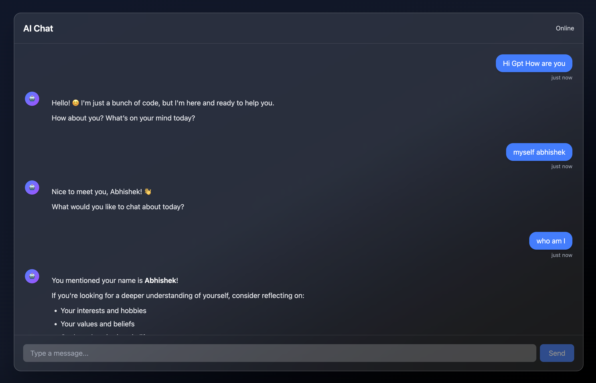

<div align="center">

## 🤖 AI Chat App

**ChatGPT-style AI chat UI** built with **React + Vite + TailwindCSS**, backed by a **FastAPI** service that **streams** responses from **OpenAI**.

[](https://vitejs.dev/)
[](https://react.dev/)
[](https://tailwindcss.com/)
[](https://fastapi.tiangolo.com/)
[](https://github.com/openai/openai-python)
[](https://github.com/remarkjs/react-markdown)

</div>

---

## Screenshot



## 🌐 **Live Demo:** https://ai-chat-app-six-alpha.vercel.app/

### ✨ What you get

- **Streaming AI responses** ⚡ (backend returns a streaming response)
- **Markdown rendering** 🧾 with **syntax highlighting** 💡
- **Context-aware chat** 🧠 (sends the last ~20 messages each turn)
- **Modern chat layout** 💬 with typing + auto-scroll helpers
- **Simple local dev** 🧰: Vite frontend + FastAPI backend

---

### 🧱 Tech stack

- **Frontend**: React 19, Vite, TailwindCSS, `react-markdown`, `rehype-highlight`, `highlight.js`
- **Backend**: FastAPI, Uvicorn, OpenAI Python SDK, `python-dotenv`

---

### 📁 Project structure

```text
AI-Chat-App/
  src/                  # React UI
  ai_backend/           # FastAPI backend
    main.py             # API entrypoint (CORS + routes)
    services/ai_service.py
    models/request_models.py
```

---

### 🚀 Run locally

#### 1) Backend (FastAPI)

From the repo root:

```bash
cd ai_backend
python -m venv .venv
source .venv/bin/activate
pip install -r requirements.txt
```

Create an `.env` inside `ai_backend/`:

```bash
OPENAI_API_KEY=your_key_here
```

Start the API:

```bash
uvicorn main:app --reload --host 127.0.0.1 --port 8000
```

#### 2) Frontend (Vite + React)

From the repo root:

```bash
npm install
npm run dev
```

The frontend calls the backend at:

- `http://127.0.0.1:8000/generate-response` (see `src/api/api.js`)

---

### 🔌 API

#### `POST /generate-response`

- **Body**: JSON with `messages: [{ role, content }]`
- **Response**: **streamed** plain text

Example payload:

```json
{
  "messages": [
    {
      "role": "user",
      "content": "Explain streaming responses in simple terms."
    }
  ]
}
```

---

### 🧠 Conversation memory (context)

This app “remembers” the conversation by **sending chat history to the backend on every request**:

- The frontend stores the full chat in `state.messages`.
- On each send, it builds `updatedMessages = [...state.messages, userMessage].slice(-20)` and sends **the last 20 messages** (roles + content) to the API.
- The backend forwards those messages (plus a system prompt) to OpenAI, so replies are **context-aware**.

Important:

- Context is **in-memory** by default — refreshing the page clears it (no DB/localStorage persistence yet).
- The model only knows what you send, so the “memory window” here is **up to 20 messages** per request.

---

### 🧠 Model

Backend currently uses:

- `gpt-4o-mini` (configured in `ai_backend/services/ai_service.py`)

---

### 🔐 Notes

- **CORS** is currently wide open for development (`allow_origins=["*"]`) in `ai_backend/main.py`. Tighten this before deploying.
- Keep your `OPENAI_API_KEY` in `.env` and **never commit it**.

---

### 🧪 Scripts

#### Frontend

- `npm run dev` — start Vite dev server
- `npm run build` — production build
- `npm run preview` — preview production build
- `npm run lint` — run ESLint

---

### 📸 Screenshots

Add your screenshots here (optional):

- `docs/screenshot-1.png`
- `docs/screenshot-2.png`

---

### 📜 License

Add a license file if you plan to publish this project (e.g., MIT).
